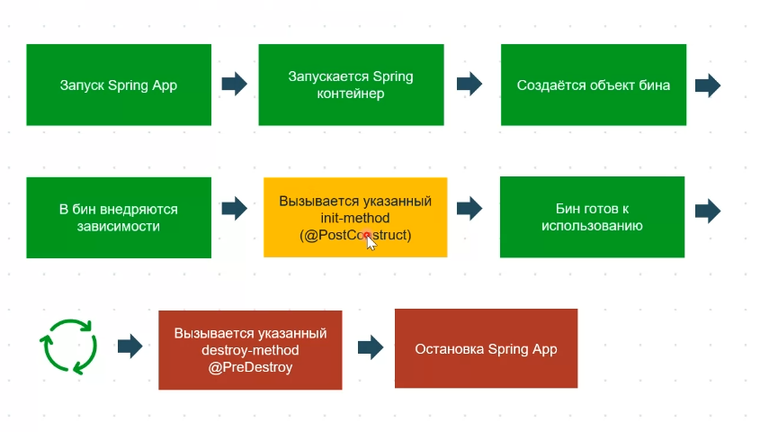

# Bean Lifecycle

BeanDefinition - (Шаблон бина, все его мета данные)

BeanDefinition Sorted - идет сортировка бинов, сперва создаются бины без параметров, дальше идут бины, на основе других бинов
Bean constructor - инициализация через конструктор
setters called - инициализация через сеттеры
beanpostprocessor (before initialization)
initialization callbacks - инициальзация при помощи метода (хуков)
beanpostprocessor (after initialization)

получение бина из IoC-container

хук на destroy бина (сработает при закрытие контекста)

